# Techno Blog

Um aplicativo em nodeJS e React que permite aos usuários visualizar um blog de notícias. 

Este projeto foi desenvolvido com a intenção de fornecer uma interface amigável e intuitiva de um blog de notícias, permitindo a criação, edição, deleção e visualização de posts. 

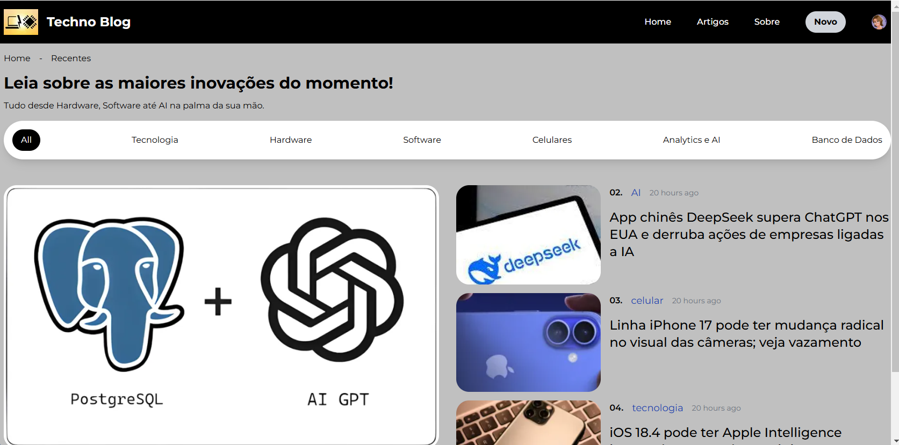

O projeto foi dividido em duas camadas:

- Frontend com a aplicação web

- Backend com a API e conexão ao Banco de Dados.


Tecnologias utilizadas:

- FrontEnd: React + Vite, HTML, CSS e Bootstrap 

- BackEnd: nodeJS+Express

- Banco de Dados: mongoDB no Atlas para armazenamento de posts e usuários.

- Autenticação e Login: Clerk
- Armazenamento de Imagens: ImageKit


Vídeo de Apresentação: https://youtu.be/TZ6kULzijKQ

## Acesso a Aplicação

A Aplicação está ativa como um serviço em um servidor linux Ubuntu local com o MongoDB no Atlas.

Url de Acesso a Aplicação: http://sol.librian.info:5731


## Funcionalidades

- **Autenticação**: Sistema de login para garantir que apenas usuários autorizados possam criar e editar as informações. 
- **Visualização**: Liste todos os posts disponíveis.
- **Filtro de Categoria**: Filtre os posts pela categoria de assuntos.
- **CRUD**: Liste, Visualize, Crie, Edite e Exclua os Posts.
- **Responsividade**: Interface adaptável para diferentes tamanhos de tela.


## Estrutura do Projeto


### Autenticação

O **Clerk** é uma solução de autenticação para aplicativos React, Next.js e outras plataformas modernas. Ele fornece uma maneira fácil de adicionar login, gerenciamento de usuários e permissões sem precisar construir tudo do zero.

#### **Resumo de Funcionamento do Clerk**

1. **Autenticação de Usuários**
   - Oferece login via e-mail/senha, redes sociais (Google, GitHub, etc.), autenticação sem senha (magic link) e Web3 (wallets).
   - Usa `ClerkProvider` para gerenciar autenticação no app.
2. **Gerenciamento de Sessões**
   - Mantém o estado do usuário e sua sessão ativa automaticamente.
   - Usa hooks como `useAuth()` para verificar se o usuário está autenticado.
3. **Controle de Acesso**
   - Permite restringir páginas ou componentes para usuários autenticados.
   - Usa `<SignedIn>` para mostrar conteúdo apenas para logados e `<SignedOut>` para não logados.
4. **Perfis e Dados do Usuário**
   - Fornece `useUser()` para acessar informações como nome, e-mail e avatar.
   - O `UserButton` exibe um menu de perfil pronto.
5. **Integração com Backend e APIs**
   - O `getToken()` obtém um token JWT para autenticação com APIs protegidas.

  Maiores informações: https://clerk.com/docs/how-clerk-works/overview


### Gestão de Imagens

O **ImageKit** foi a solução encontrada para o armazenamento de Imagens na nuvem.

É feito o upload de imagens na nuvem via API, de forma a não armazenar localmente, e no banco armazena apenas a url do caminho da imagem.

Maiores informações: https://imagekit.io/docs/overview


### Banco de Dados

Está sendo usado o MongoDB dentro do Atlas.

Estrutura dos Dados:

Post Collection:

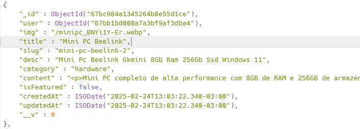

User Collection:

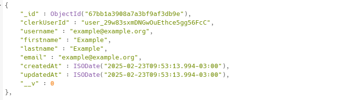


### Backend

Foi criada uma API para gestão dos posts conectado no MongoDB, assim como um webhook de conexão com o Clerk.

As funções de Edição, Criação e Deleção de Posts precisam de Autenticação Bearer.

As funções de getPosts e getPost são abertas.


#### Estrutura

- `index.js`: Arquivo principal do aplicativo.
- `controllers/`: Diretório que contém os controladores (controllers) da API, responsáveis pela lógica de negócios e manipulação de dados. 
  - `postcontroller.js` contém as funções para operações CRUD.
  - `usercontroller.js` contém as funções para de gestão de usuários na associação de usuários aos posts.
  - `webhookcontroller.js` contém as funções para a gestão do webhook com o Clerk e criação dos usuários no Banco.

- `routes/`: Diretório que contém as definições de rotas da API. 
  - O `postRoute.js` define as rotas para operações CRUD nos posts, associando cada rota a uma função do controlador.
  - `userRoute.js` define as rotas para operações CRUD dos usuários, associando cada rota a uma função do controlador.
  - `webhookRoute.js` define as rotas para operações do webhook, associando cada rota a uma função do controlador.


- `models/`: Diretório que contém os modelos Mongoose, definindo a estrutura dos documentos no MongoDB. 
  - O `postmodel.js` define o esquema do documento do post.
  - O `usermodel.js` define o esquema do documento de usuário.

- `lib/`: Diretório que contém a função de conexão com o banco de dados. 

Observação: As variáveis de ambiente como a URL para conexão com o banco e chaves de autenticação foram registradas em um arquivo oculto .env .


#### Endpoins

**Get Posts** ("/", getPosts);

**Get Post** ("/:slug", getPost);

**Create Post** ("/", requireAuth(), createPost);

**Update Post** ("/:id", requireAuth(), updatePost);

**Delete Post** ("/:id", requireAuth(), deletePost);


### FrontEnd

- `src/` Toda estrutura do código está nessa pasta.

  - `layouts/` Diretório onde tem o MainLayout.jsx

  - `routes/` Diretório onde tem o design e composição das telas.
    - `AboutPage.jsx` 
    - `Homepage.jsx`
    - `LoginPage.jsx` 
    - `PostListPage.jsx`
    - `RegisterPage.jsx`
    - `SinglePostPage.jsx`
    - `Write.jsx`


  - `componentes/` Diretório onde tem os componentes que compõe as telas.
    - `FeaturePosts.jsx`
    - `Image.jsx`
    - `MainCategory.jsx`
    - `Navbar.jsx`
    - `PostList.jsx`
    - `PostListItem.jsx`


Arquivos na Raiz:

- `.env`: Usado para armazenar variáveis de ambiente, como chaves de API e URLs.

- `.gitignore`: Especifica quais arquivos ou diretórios devem ser ignorados pelo Git.
- `package.json`: Contém informações sobre o projeto, incluindo dependências, proxy, porta e scripts de execução.
- `README.md`: Documentação do projeto, incluindo instruções de instalação, uso e contribuição.


## Principais Telas, Componentes e Funcionalidades

### Navbar.jsx

Menu Superior com Logo e Botões de redirecionamento.

Rotas: 

- Ao clicar em Login redireciona para a tela de login.
- Ao clicar em Home ou no nome do site redireciona para a Homepage.jsx ( / ).
- Ao clicar em Artigos vai para a tela de PostList.jsx (/posts).
- Ao clicar em sobre vai para a tela de sobre (/about)
- Caso o usuário esteja logado o Botão Novo aparece e é possível ir para a tela de criação de Posts.

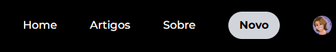


### LoginPage.jsx e RegisterPage.jsx

Componentes do Clerk através de SignIn e SignUp do "@clerk/clerk-react".

Nessas telas é possível logar ou criar um novo usuário.

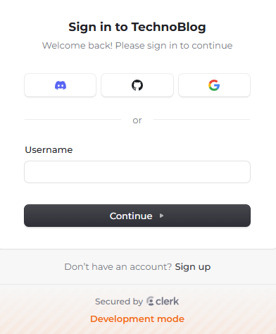            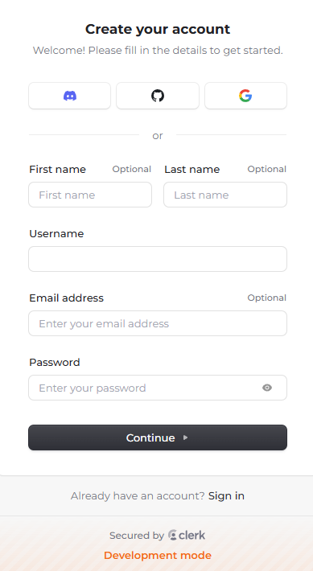 


### Homepage.jsx

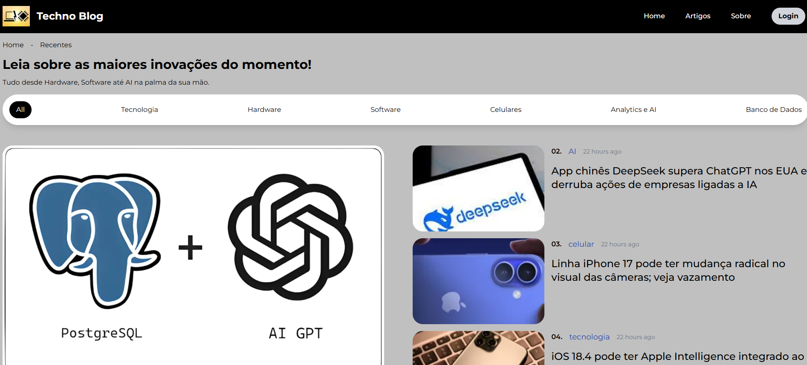

Essa é a tela inicial do sistema que apresenta os 4 posts mais recentes e destacados.

Ela é composta por:

- Navbar - Barra superior com logo e o menu principal.

- Main Category - Barra de filtro por categoria.
- Feature Posts - Posts Recentes em um layout estático.


**Rotas:** 

- Em qualquer Post, ao clicar no nome do Post Redireciona para o Post - SinglePostPage (/slug)
- Ao clicar numa categoria relacionada ao Post redireciona para a tela de Artigos (/posts?category={category})


### PostListPage.jsx

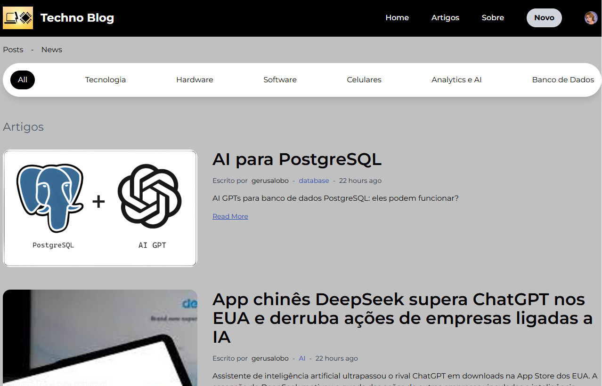


A tela de PostList é uma tela que apresenta os posts por ordem decrescente do mais recente para o mais antigo.

Ela carrega 10 post, mas com o scroll pra baixo ela vai carregando mais posts.

A barra de filtro de categoria, permite o filtro por categoria apresentando só os posts relacionados a categoria indicada.

Ela é composta por:

- Navbar - Barra superior com logo e o menu principal.

- Main Category - Barra de filtro por categoria.
- PostList - Lista de Posts usando o componente PostListitem.

**Rotas:** 

- Em qualquer Post, ao clicar no nome do Post Redireciona para o Post - SinglePostPage (/slug)
- Ao clicar numa categoria relacionada ao Post redireciona para a tela de Artigos (/posts?category={category})


### SinglePostPage.jsx

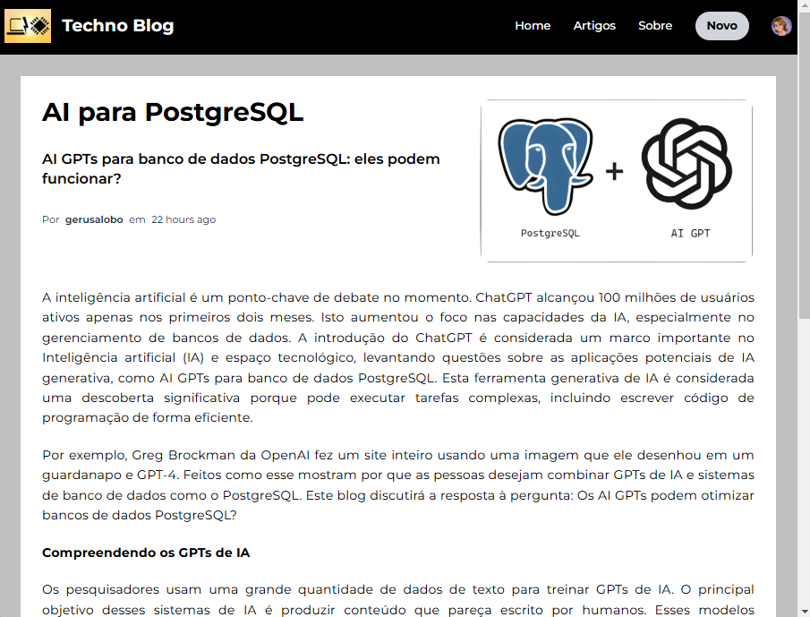

Se o usuário estiver logado, essa tela apresenta ao final os botões de Delete ou Editar o Post.

**Rotas:** 

- Ao clicar em delete, te uma mensagem de confirmação, e o post é detetado voltando para a Home.
- Ao clicar em Edit, chama a tela Write, com os dados do Post a ser editado.


### Write.jsx

Essa tela é usada para criação e Edição de Posts.

Em caso de Edição ela carrega os dados do Post a serem editados.

Permite o upload de arquivos para o imageKit e montar o conteúdo do Post em Html usando o ReactQuill.


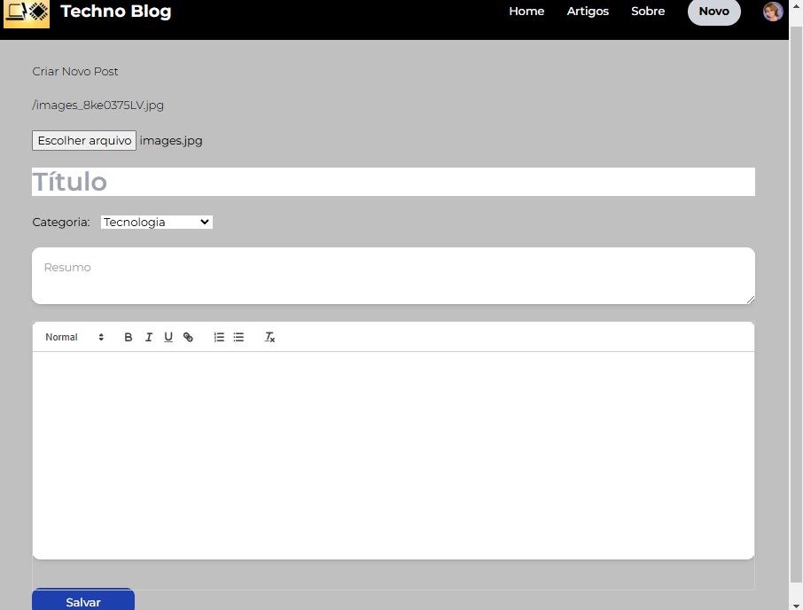


### AboutPage.jsx

É uma página estática sobre o Projeto.

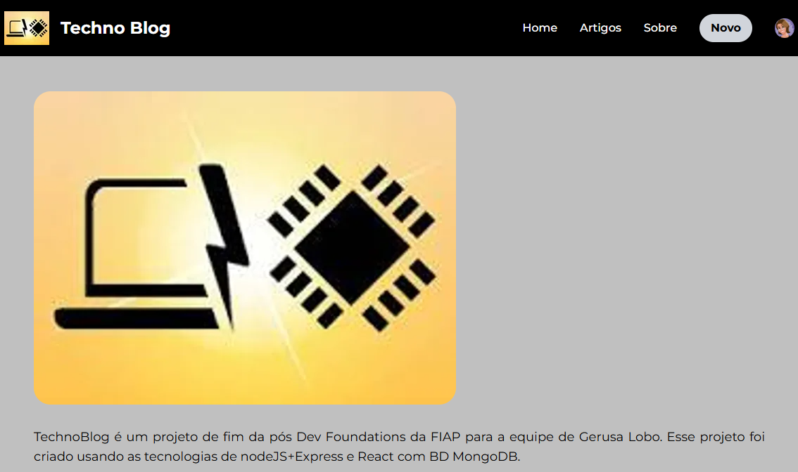


## Configuração e Uso

Para facilitar, na documentação no Git tem um .env_model no frontend e no backend com todos os itens que precisam de configuração para o funcionamento da Aplicação.

**Copiar e Instalar Dependências**:

```
bash
Copiar código

/backend
npm install

/frontend
npm install
```

**Ativar e configurar o MongoDB**

```
/backend
.env
MONGODB_URI=
```

**Ativar e configurar o Clerk**

```
/backend
.env
CLERK_WEBHOOK_SECRET=
CLERK_PUBLISHABLE_KEY=
CLERK_SECRET_KEY=

/frontend
.env
VITE_CLERK_PUBLISHABLE_KEY = 
```

**Ativar e configurar o Imagekit**

```
/backend
.env
CLERK_WEBHOOK_SECRET=
CLERK_PUBLISHABLE_KEY=
CLERK_SECRET_KEY=

/frontend
.env
IK_URL_ENDPOINT = 
IK_PUBLIC_KEY = 
IK_PRIVATE_KEY = 
```

**Proxy no Vite**

```
/frontend
vite.config.js

Todas as chamadas de API estão configuradas com endereço relativo via proxy.
Ajustar o vite.config.js com o IP Local do servidor que tem a API.

target: 'http://192.168.1.202:3000', // URL da API local
```

**Executar o servidor**:

```
bash
cd /backend
node index.js

cd /frontend
npm run dev
```

Caso queira rodar como serviço ver na documentação: /serviços/Como criar o serviço.

**Acesso a Aplicação**:

  Caso rode a aplicação de forma local, o acesso será através da url: http://localhost:5173

## Ambientes Utilizados no Desenvolvimento


- O desenvolvimento foi realizado usando o VSCode em máquina Windows 11 com acesso a API via rede local.
- O software foi implantado em produção em um servidor linux Mint local conectado a API via localhost, e a aplicação ativada como serviço.
